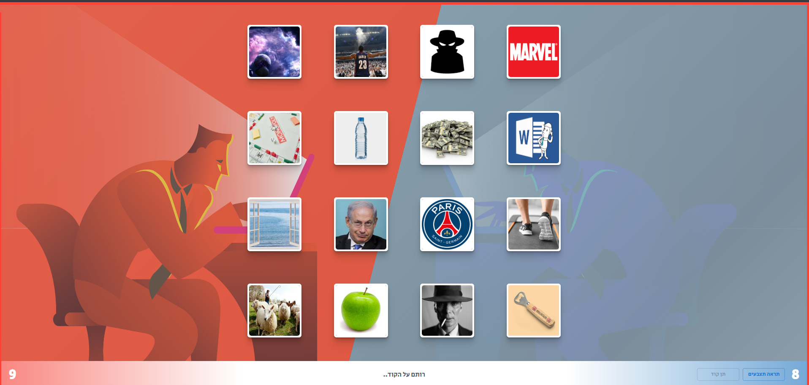
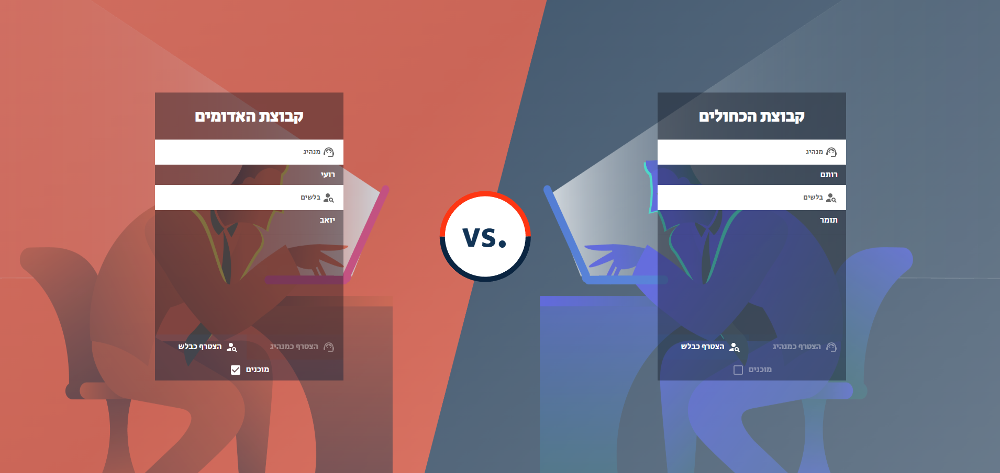

# project-name

**A Fun, Image-Based Codenames Game**

project-name is a digital adaptation of the popular board game Codenames, designed for fun and casual play with friends. This version offers a unique twist by using images instead of words and incorporates a custom algorithm to generate engaging and unpredictable combinations.

**Live Website:** [https://shem-code.web.app/](https://shem-code.web.app/)

  

## Description

project-name brings the core gameplay of Codenames to the digital world with several exciting enhancements:

* **Image-Based Gameplay:** Instead of words, players guess the secret identities of agents based on visual clues, adding a new layer of interpretation and fun.
* **Unique Combination Algorithm:** A custom-built algorithm generates fresh and challenging image combinations, ensuring high replayability and unpredictable gameplay.
* **Classic Codenames Features:**
    * Team-based gameplay (red vs. blue).
    * Spymasters giving one-word clues and a number.
    * Guessers identifying their team's agents.
    * The deadly assassin that ends the game.
* **Fun for Friends:** Designed for casual enjoyment and social interaction among friends.
* **Firebase Backend:** Provides a reliable and scalable backend for game state management and real-time updates.
* **MUI Frontend:** A user-friendly and responsive interface built with Material UI.

This project is intended for entertainment purposes and is a fan-made adaptation of Codenames.

## Technologies Used

* **React:** Frontend framework.
* **Firebase:** Backend services (Realtime Database, Authentication, Hosting).
* **Material UI (MUI):** UI component library.
* **JavaScript:** Programming language.

## Getting Started

To run this project locally, follow these steps:

1.  **Clone the repository:**

    ```bash
    git clone https://github.com/roEiA7/project-name
    cd project-name
    ```

2.  **Install dependencies:**

    ```bash
    npm install
    ```

3.  **Set up Firebase:**

    * Create a Firebase project at [console.firebase.google.com](https://console.firebase.google.com).
    * Enable Realtime Database and Authentication.
    * Create a `.env.local` file in the root of your project and add your Firebase configuration:

        ```
        REACT_APP_FIREBASE_API_KEY=YOUR_API_KEY
        REACT_APP_FIREBASE_AUTH_DOMAIN=YOUR_AUTH_DOMAIN
        REACT_APP_FIREBASE_DATABASE_URL=YOUR_DATABASE_URL
        REACT_APP_FIREBASE_PROJECT_ID=YOUR_PROJECT_ID
        REACT_APP_FIREBASE_STORAGE_BUCKET=YOUR_STORAGE_BUCKET
        REACT_APP_FIREBASE_MESSAGING_SENDER_ID=YOUR_SENDER_ID
        REACT_APP_FIREBASE_APP_ID=YOUR_APP_ID
        ```

    * Replace the placeholder values with your actual Firebase configuration.

4.  **Run the application:**

    ```bash
    npm start
    ```

    This will start the development server, and you can view the application in your browser at `http://localhost:3000`.

## Deployment

The project can be deployed using Firebase Hosting. To deploy your own version:

1.  **Install the Firebase CLI:**

    ```bash
    npm install -g firebase-tools
    ```

2.  **Log in to Firebase:**

    ```bash
    firebase login
    ```

3.  **Initialize Firebase in your project:**

    ```bash
    firebase init
    ```

    Follow the prompts to set up Firebase Hosting.

4.  **Build the project:**

    ```bash
    npm run build
    ```

5.  **Deploy to Firebase Hosting:**

    ```bash
    firebase deploy --only hosting
    ```

## Contributing

This project is primarily for personal use, but contributions are welcome. If you find any issues or have suggestions, especially regarding the image selection or algorithm, please feel free to open an issue or submit a pull request.

## Future Enhancements

* Expand the image library.
* Fine-tune the combination algorithm for optimal gameplay balance.
* Add user accounts and game history.
* Implement different game modes or variations.
* Improve UI/UX based on user feedback.

## License

This project is licensed under the MIT License.